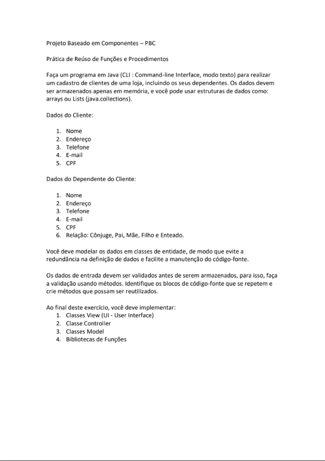
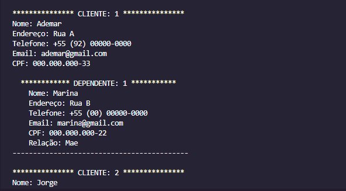

# Atividade de Programação Baseada a Componentes - Cadastro de Clientes de uma Loja

## Documento Oficial da Atividade



## Exemplo de Saída



# Projeto Baseado em Componentes - PBC

Bem-vindo ao projeto de cadastro de clientes de uma loja, incluindo seus dependentes! Aqui você encontrará todas as informações necessárias para entender e utilizar o programa. Vamos lá!

## 📋 Dados do Cliente

1. Nome
2. Endereço
3. Telefone
4. E-mail
5. CPF

## 📋 Dados do Dependente do Cliente

1. Nome
2. Endereço
3. Telefone
4. E-mail
5. CPF
6. Relação: Cônjuge, Pai, Mãe, Filho e Enteado.

## 🏗️ Organização do Código

Neste projeto, os dados foram organizados de forma eficiente para facilitar a manutenção e reutilização de código. Veja como está estruturado:

1. **👀 Classes View (UI - User Interface):** Essas classes são responsáveis por interagir com você, usuário! Elas exibem informações e permitem que você insira os dados necessários.

2. **🎛️ Classe Controller:** Aqui está a "mágica" acontecendo! Essa classe controla toda a lógica do programa, garantindo que tudo funcione corretamente. Ela recebe os dados da interface (View), valida-os e conecta com as classes Model.

3. **🧩 Classes Model:** Essas são as classes que representam os clientes e seus dependentes. Elas contêm todos os atributos e métodos necessários para manipular essas informações.

4. **📚 Bibliotecas de Funções:** Conjunto de funções e procedimentos que podem ser reutilizados em diversas partes do código. Isso deixa nosso projeto mais organizado e fácil de manter.

## Exemplo de Entrada

Aqui está um exemplo de como você pode criar um cliente e adicionar um dependente:

```java
Cliente cliente1 = new Cliente("Ademar", "Rua A", "+55 (92) 00000-0000",
    "ademar@email.com", "000.000.555-33");
cliente1.addDependente(new Dependente("Filho Um", "Rua D", "+55 (92) 00000-0000",
    "filho01@email.com", "000.000.555-22", RelacaoEnum.valueOf(DependenteUI.formatarTexto("Mãe"))));
```

Sinta-se à vontade para utilizar esse exemplo como base e explorar todas as funcionalidades do programa!

## 🚀 Conclusão

Ao concluir este projeto de cadastro de clientes e seus dependentes, aprendi valiosas lições sobre programação orientada a objetos, reúso de código e organização de projetos.

Durante o desenvolvimento, pude compreender a importância de modelar os dados em classes de entidade para evitar redundâncias e facilitar a manutenção do código-fonte. A separação das responsabilidades em classes View, Controller e Model foi essencial para uma arquitetura bem estruturada.

A prática de reúso de código, ao identificar blocos repetitivos e encapsulá-los em métodos reutilizáveis, tornou o código mais limpo e legível. Além disso, a validação dos dados de entrada antes do armazenamento contribuiu para a integridade dos dados e a consistência do sistema.

Esse projeto me permitiu desenvolver minhas habilidades em Java e compreender melhor os conceitos de programação orientada a objetos. Também percebi a importância de uma boa interface de usuário, que torna a interação com o programa mais intuitiva e agradável.

Estou entusiasmado com o que aprendi e já penso em adicionar novas funcionalidades ao projeto, como busca e atualização de registros. Tenho certeza de que continuarei aprimorando minhas habilidades de programação e desenvolvendo projetos mais eficientes.

Agradeço pela oportunidade e pelo suporte recebido durante o desenvolvimento. Estou confiante de que os conhecimentos adquiridos serão aplicáveis em projetos futuros. Sigamos em frente, explorando novas possibilidades e expandindo nossos horizontes na área da programação!

Divirta-se programando e conte comigo para qualquer dúvida ou suporte necessário! 🌟

## Contato

- E-mail: ademar.castro.curriculo@gmail.com
- LinkedIn: [Meu LinkedIn](https://www.linkedin.com/in/ademar-castro-8bb95b256/)